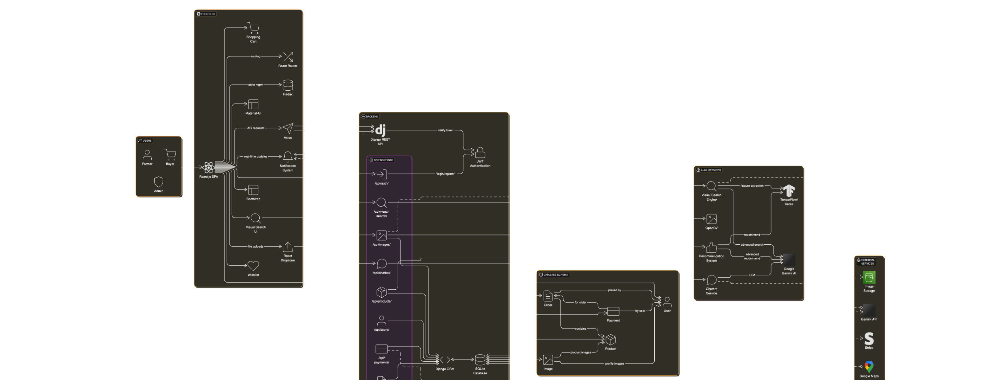

# Farming E-Commerce Platform with Visual Product Search and ChatBot

A modern e-commerce platform specifically designed for farming products, featuring advanced visual product search capabilities and an integrated chatbot system powered by Google's Gemini AI.

## 🏗️ System Architecture

Below is the detailed system architecture diagram of our platform, showcasing the interaction between different components, services, and data flow:



The architecture is divided into several key components:

- Frontend Layer (React.js SPA)
- Backend Services (Django REST Framework)
- AI/ML Services (Gemini AI, TensorFlow, OpenCV)
- Database Layer
- Authentication & Security Layer

## 🚀 Features

### Frontend Features

- **Modern UI/UX**

  - Built with React.js and Material-UI
  - Responsive design for all devices
  - Interactive product carousel
  - Real-time notifications with toast messages
  - Smooth animations using Framer Motion

- **User Management**

  - User authentication and authorization
  - Profile management
  - Secure login system
  - Session persistence with Redux

- **Product Management**

  - Product listing and categorization
  - Advanced search functionality
  - Product filtering and sorting
  - Detailed product pages
  - Image gallery with zoom capabilities

- **Shopping Experience**

  - Shopping cart functionality
  - Wishlist management
  - Order tracking
  - Real-time inventory updates

- **Visual Search**
  - Image-based product search
  - Upload and search by image
  - Visual similarity matching
  - Real-time search results

### Backend Features

- **Django REST Framework**

  - RESTful API architecture
  - JWT authentication
  - CORS support
  - Rate limiting
  - API documentation

- **Database Management**

  - SQLite database
  - Efficient data models
  - Data validation
  - Query optimization

- **AI/ML Integration**

  - TensorFlow and Keras for image processing
  - OpenCV for computer vision
  - Machine learning models for visual search
  - Natural language processing for chatbot
  - Google Gemini AI integration for advanced conversational capabilities
  - Smart product recommendations based on user queries
  - Context-aware responses for farming-related queries
  - Multi-modal AI capabilities (text and image understanding)

- **Order Management**

  - Order processing system
  - Inventory tracking
  - Order status updates
  - Payment processing integration

- **Location Services**
  - Google Maps integration
  - Location-based services
  - Geocoding capabilities
  - Distance calculations

## 🛠️ Technology Stack

### Frontend

- React.js
- Redux for state management
- Material-UI and Bootstrap for UI components
- Axios for API calls
- React Router for navigation
- SASS for styling
- React Dropzone for file uploads
- React Slick for carousels
- Recharts for data visualization

### Backend

- Django
- Django REST Framework
- TensorFlow and Keras
- OpenCV
- JWT Authentication
- SQLite Database
- Google Gemini AI API

## 📦 Installation

1. Clone the repository

```bash
git clone [repository-url]
```

2. Install Frontend Dependencies

```bash
cd frontend
npm install
```

3. Install Backend Dependencies

```bash
cd backend
pip install -r requirements.txt
```

4. Set up environment variables

- Create `.env` files in both frontend and backend directories
- Configure necessary API keys and settings

5. Run the Development Servers

```bash
# Frontend
cd frontend
npm start

# Backend
cd backend
python manage.py runserver
```

## 🔧 Configuration

- Configure API keys in `.env` files
- Set up database settings in `backend/core/settings.py`
- Configure frontend API endpoints in `frontend/src/services`

## 🤝 Contributing

1. Fork the repository
2. Create your feature branch (`git checkout -b feature/AmazingFeature`)
3. Commit your changes (`git commit -m 'Add some AmazingFeature'`)
4. Push to the branch (`git push origin feature/AmazingFeature`)
5. Open a Pull Request
